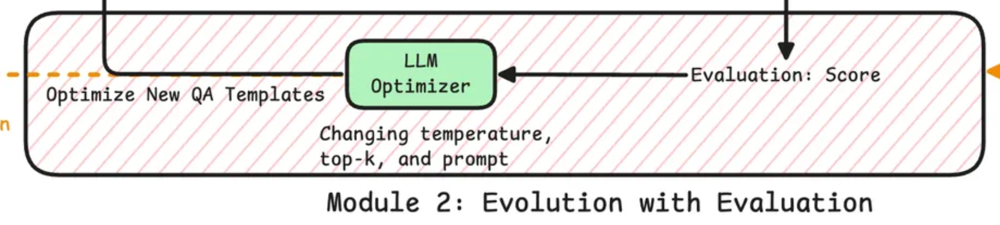

### Ryze-Eval | [English](./README_EN.md)

一个用于评测科研类多模态问答数据集 Lab-Bench 的轻量级评测与可视化工具集。



---

## 功能概览

- **数据获取与管理**: 按配置分别下载 Lab-Bench 各子集并保存为 JSON
- **评测执行**: 支持对单个或全部子集进行选择题评测，可限制条数快速验证
- **多模型对接**: 通过统一接口对接 `ollama / openai / deepseek / gemini / anthropic`
- **结果保存**: 自动输出明细与汇总指标（准确率、覆盖率、平均响应时长等）
- **结果可视化**: 一键生成子集对比、子任务热力图、响应时长分布图
- **样例导出**: 从 FigQA / TableQA 子集导出示例图片，便于快速查看

---

## 目录结构

- `src/run_evaluation.py` 运行评测入口
- `src/dataset_loader.py` 数据集下载/保存/加载
- `src/evaluator.py` 评测逻辑与指标统计
- `src/model_interface.py` 各模型提供商的统一接口
- `src/visualizer.py` 结果可视化与摘要报告
- `src/analyze_dataset.py` 数据概览与统计
- `src/extract_images.py` 抽取样例图片
- `src/test_dataset_loading.py` 数据加载验证脚本
- `requirements.txt` 依赖

---

## 安装与环境

1) Python 版本: 3.10+
2) 安装依赖:

```bash
pip install -r requirements.txt
```

3) 配置环境变量（在项目根目录创建 `.env`）:

```bash
# 选择默认提供商: ollama / openai / deepseek / gemini / anthropic
MODEL_PROVIDER=ollama

# 通用可选项
MAX_TOKENS=4096
TEMPERATURE=0.7

# Ollama
OLLAMA_HOST=http://localhost:11434
OLLAMA_MODEL=gemma3:12b

# OpenAI
# OPENAI_API_KEY=your_key
# OPENAI_MODEL=gpt-4o

# DeepSeek
# DEEPSEEK_API_KEY=your_key
# DEEPSEEK_BASE_URL=https://api.deepseek.com
# DEEPSEEK_MODEL=deepseek-v3

# Gemini
# GEMINI_API_KEY=your_key
# GEMINI_MODEL=gemini-2.5-pro

# Anthropic
# ANTHROPIC_API_KEY=your_key
# ANTHROPIC_MODEL=claude-3-5-sonnet
```

---

## 快速开始

- 仅下载并保存数据集（到 `./data/processed`）

```bash
python -m src.run_evaluation --download-only
```

- 运行评测（示例：只评测 FigQA，限制前 50 条，保存到 `./results`）

```bash
python -m src.run_evaluation --provider ollama --subset FigQA --limit 50 --output-dir ./results --verbose
```

- 评测所有子集

```bash
python -m src.run_evaluation --provider openai --subset all --output-dir ./results
```

- 可视化最近一次评测结果（图片与摘要报告将保存在 `results/visualizations/`）

```bash
python -m src.visualizer --results-dir ./results
```

- 数据集全量分析与概览（会生成 `dataset_analysis.json` 与 `dataset_summary.csv`）

```bash
python -m src.analyze_dataset
```

- 抽取 FigQA/TableQA 示例图片到 `./sample_images/`

```bash
python -m src.extract_images
```

- 验证数据加载配置是否正确

```bash
python -m src.test_dataset_loading
```

---

## 输出产物

- `results/detailed_results_*.json`: 每道题的原始响应与判断
- `results/evaluation_report_*.json`: 汇总指标（总体/子集/子任务）
- `results/visualizations/`: 可视化图片与摘要报告
- `dataset_analysis.json`、`dataset_summary.csv`: 数据集分析与汇总
- `sample_images/`: 抽取的示例图片与 `image_info.json`

---

## 常见问题

- 初始化模型报错：检查 `.env` 是否配置、Ollama 服务是否启动、云端 API Key 是否有效。
- 评测未覆盖全部题目：可提高 `MAX_TOKENS` 或检查输出解析是否返回合法选项字母（A-H）。

---

## 许可

本项目遵循 `LICENSE` 文件所述许可协议。

